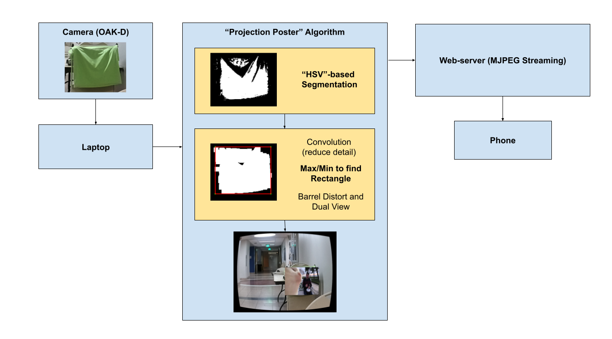

# postAR

### Won 2 Awards ("Best Solo Hacker 2nd Place" and "Most Useless")! 😄

---

**Descrption:**

A VolHack 2021 Project - Projecting a poster or digital item onto a green screen in realtime.

**[Video Link](https://www.youtube.com/watch?v=qtkfbua-O0Y)**

## Requirements

### Hardware:
- Google Cardboard Headset
- Luxonis OAK-D
- Host Computer (Windows or Linux-based)

### Sofware:
- [DepthAI API](https://github.com/luxonis/depthai)
- numPy
- OpenCV2 (3+)
- [imutils](https://github.com/PyImageSearch/imutils)
- tKinter

## How It Works

I utilized various image processing techniques to reach a reliable projection method.

The first component is the HSV-based segmentation method, which is a fairly simple method of segmentation. We use OpenCV's `inRange` function, which can be calibrated with `picker.py`.

The next component is a convolution that reduces the ganularity of the segmentation mask. This way we can get a shape that is less sensitive to pixel-wise changes.

The last component is a method to find a rectangle from the reduced mask. From then, it is just a simple distortion (barrel distortion) and split screen filter to create a VR-like view.

Since all of this is happening on the laptop, we would want to stream it to the display (a phone) via MJPEG streaming, which just uses a HTML webpage.

### Streaming Example:

